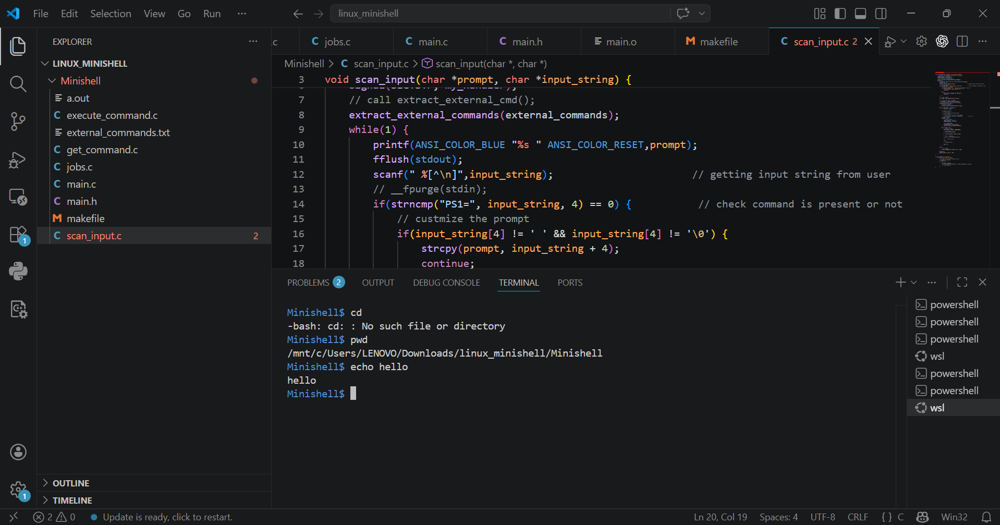
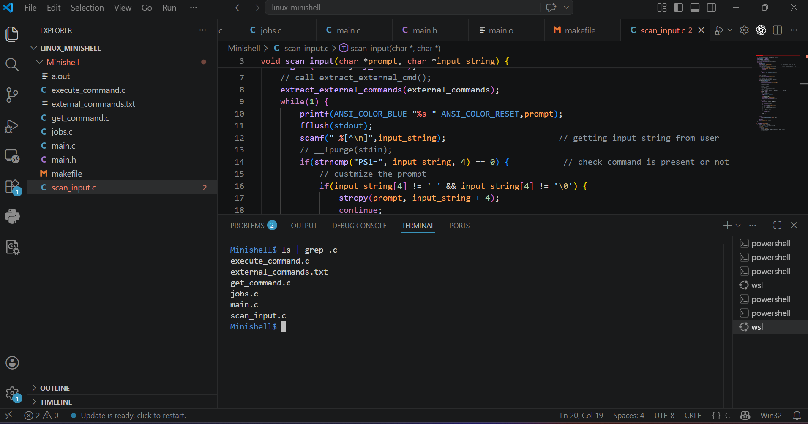
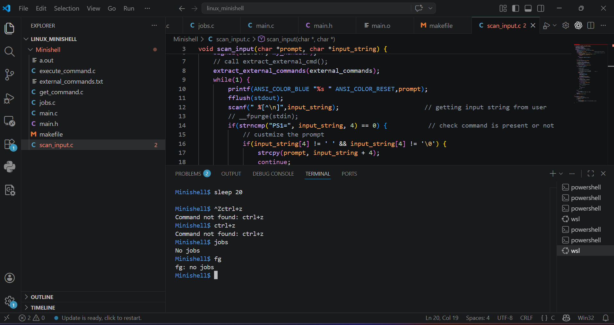

# Linux Mini Shell

## Author

Om Bidikar

---

## About the Project

This project is a custom implementation of a Linux command-line shell written in C.

It mimics core functionalities of a Unix shell by accepting user commands, parsing them, and executing them using system calls. The shell supports both internal and external commands along with advanced features like piping and job control.

---

## Features

* Execute external Linux commands
* Built-in commands: `cd`, `pwd`, `echo`, `exit`
* Command parsing and execution
* Support for piping (`|`)
* Job control (`jobs`, `fg`, `bg`)
* Signal handling (`Ctrl+C`, `Ctrl+Z`)
* Customizable shell prompt (`PS1`)

---

## 📁 Project Structure

Linux_Mini_Shell/

Source Files:

* src/ (main.c, scan_input.c, get_command.c, execute_command.c, jobs.c)

Header Files:

* include/ (main.h)

Command List:

* external_commands.txt

Screenshots:

* screenshots/

Build:

* Makefile

Documentation:

* README.md

---

## ⚙️ How to Compile

```bash
make
```

---

## ▶️ How to Run

```bash
./a.out
```

---

## 🧪 Example Commands

### Basic Commands

```bash
ls
pwd
date
```

### Built-in Commands

```bash
cd ..
pwd
echo hello
exit
```

### Pipes

```bash
ls | grep .c
```

### Job Control

```bash
sleep 20
# Press Ctrl+Z
jobs
fg
bg
```

---

## 📸 Output Screenshots

### Basic Commands



### Pipes



### Job Control



---

## 🧠 Concepts Used

* Process Management (`fork`, `exec`, `wait`)
* Inter-process Communication (pipes)
* Signal Handling (`SIGINT`, `SIGTSTP`)
* Command Parsing
* Job Control Mechanism
* Linux System Calls

---

## ⚠️ Limitations

* Limited support for complex command chaining
* Basic parsing logic
* No advanced scripting support

---

## 💡 How It Works

The shell continuously reads user input, parses it into commands and arguments, and determines whether it is an internal or external command.

For external commands, a child process is created using `fork()` and executed using `execvp()`.
For piped commands, multiple processes are created and connected using pipes.

Signal handling enables control of running processes using `Ctrl+C` and `Ctrl+Z`, and supports job management using `fg` and `bg`.

---

## 📘 License

This project is for learning purposes.
